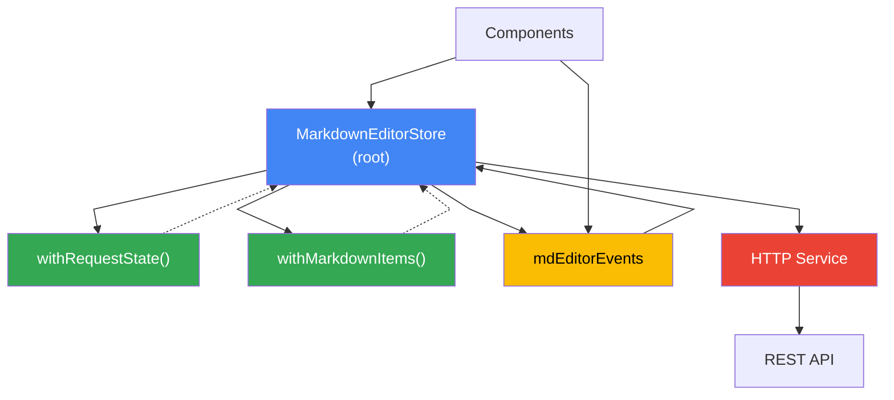

## Overview

The **Markdown Editor** is a real-world demonstration of composing custom NgRx Signal Store features into a complete, production-like CMS interface. Located in the demo app's bottom split-pane, it manages a collection of `MarkdownItem` entities and introduces the concept of **page overrides**—the ability to customize and persist the markdown guide text for the currently active demo page. Each item can be a regular comment (persisted with `id > 0`), a new unsaved comment (`id: 0`), or a page guide override (`id: -1`). When a page has no saved override, a **ghost** entry is synthesized from the original markdown file; once edited and saved, it becomes **unghosted** and persists to the database via `PUT /markdownItems/-1`. The store uses a multi-feature composition pattern with `withMarkdownItems()` for entity CRUD operations and `withRequestState()` for loading and error handling, while event handlers (`mdEditorEvents`) orchestrate asynchronous HTTP operations. This design showcases how to encapsulate complex business logic—like distinguishing page overrides from comments, computing derived state (page saves, overrides), and managing item lists—directly within store features, keeping components lean and focused on presentation.

## Architecture



## Store Composition

The main store in `markdown-editor.store.ts` composes multiple features and uses the event-driven architecture:

```typescript
export const markdownEditorStore = signalStore(
    { providedIn: 'root' },
    withRequestState(),
    withMarkdownItems(),
    withReducer(
        on(mdEditorEvents.fetch, mdEditorEvents.save, mdEditorEvents.delete, () =>
            ({ isLoading: true, error: null as string | null })
        ),
        on(mdEditorEvents.fetchSuccess, ({ payload }) =>
            [addEntities(payload), { isLoading: false }]
        ),
        on(mdEditorEvents.saveSuccess, ({ payload }) =>
            [setEntity(payload), { isLoading: false }]
        ),
        on(mdEditorEvents.deleteSuccess, ({ payload }) =>
            [removeEntity(payload), { isLoading: false }]
        ),
    ),
    withEventHandlers((_, events = inject(Events), service = inject(MarkdownEditorService)) => ({
        loadItems$: events.on(mdEditorEvents.fetch).pipe(
            exhaustMap(() =>
                service.getMarkdownItems().pipe(
                    mapResponse({
                        next: (items) => mdEditorEvents.fetchSuccess(items),
                        error: (err: Error) => mdEditorEvents.fetchFailed(err.message),
                    }),
                ),
            ),
        ),
        saveItem$: events.on(mdEditorEvents.save).pipe(
            exhaustMap(({ payload }) =>
                service.saveMarkdownItem(payload).pipe(
                    mapResponse({
                        next: (saved) => mdEditorEvents.saveSuccess(saved),
                        error: (err: Error) => mdEditorEvents.saveFailed(err.message),
                    }),
                ),
            ),
        ),
        deleteItem$: events.on(mdEditorEvents.delete).pipe(
            exhaustMap(({ payload }) =>
                service.deleteMarkdownItem(payload).pipe(
                    mapResponse({
                        next: () => mdEditorEvents.deleteSuccess(payload.id),
                        error: (err: Error) => mdEditorEvents.deleteFailed(err.message),
                    }),
                ),
            ),
        ),
    })),
    withHooks({
        onInit(_, dispatcher = inject(Dispatcher)) {
            dispatcher.dispatch(mdEditorEvents.fetch());
        },
    })
);
```

## withMarkdownItems Feature

The `with-markdown-items.ts` feature handles entity management with business logic for page overrides and comments:

```typescript
export function withMarkdownItems() {
    return signalStoreFeature(
        withEntities<MarkdownItem>(),
        withComputed((store) => ({
            pageOverrides: computed(() => 
                store.entities().filter(i => i.id === -1)
            ),
            comments: computed(() => 
                store.entities().filter(i => i.id > 0)
            ),
            getPageOverride: computed(() => (url: string) =>
                store.entities().find(i => i.id === -1 && i.url === url) ?? null
            ),
            isPageSaved: computed(() => (url: string) =>
                store.entities().some(i => i.id === -1 && i.url === url)
            ),
        })),
        withMethods((store) => ({
            listItems(url: string, title: string, fallbackMd: string): MarkdownItem[] {
                const items = store.entities();
                if (!title) return items;
                
                const saved = items.find(i => i.id === -1 && i.url === url);
                if (saved) {
                    return [saved, ...items.filter(i => !(i.id === -1 && i.url === url))];
                }
                
                return [
                    { id: -1, url, title, comment: fallbackMd, saved: undefined } as MarkdownItem,
                    ...items
                ];
            },
        })),
    );
}
```

## withRequestState Feature

Reusable loading and error state:

```typescript
export function withRequestState() {
    return signalStoreFeature(
        withState<{ isLoading: boolean; error: string | null }>({
            isLoading: false,
            error: null,
        }),
        withComputed(({ isLoading, error }) => ({
            isLoading: computed(() => isLoading()),
            error: computed(() => error()),
            isIdle: computed(() => !isLoading()),
        })),
    );
}
```

## MarkdownItem Model

```typescript
export class MarkdownItem {
    id: number = 0;        // 0=unsaved, -1=page override, >0=persisted comment
    url: string = '';      // 'demos/<route>' for page, '' for comments
    title: string = '';
    comment: string = '';  // markdown content
    saved?: Date;
}
```

**Item states:**
- **Ghost page** (`id: -1`, not in DB): Virtual entry synthesized from original `.md` file
- **Unghosted page** (`id: -1`, in DB): Saved override accessible via `PUT /markdownItems/-1`
- **Comment** (`id > 0`): Regular user notes, persisted via `POST` then `PUT`
- **New comment** (`id: 0`): Unsaved, triggers `POST` on save

## Key Takeaway

Custom features let you compose stores from reusable building blocks—each feature encapsulates state, computed properties, and methods. The event-driven architecture with `mdEditorEvents` makes data flow explicit and testable. The **ghost/unghosted** page pattern showcases how to synthesize virtual data (the original guide) and let users override it persistently—a powerful CMS pattern where the app always has sensible defaults but users can customize any page on the fly.
