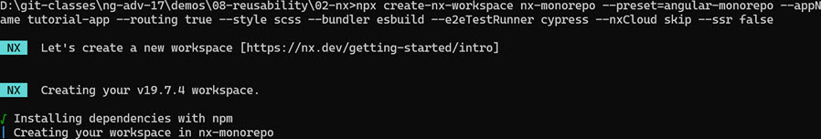
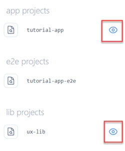

# Monorepos & nrwl nx

[Nx Home](https://nx.dev/angular)

[npx create-nx-workspace](https://nx.dev/nx/create-nx-workspace)

[Angular Nx Tutorial ](https://nx.dev/getting-started/angular-tutorial)

[Nx Console - VS Code Extension](https://marketplace.visualstudio.com/items?itemName=nrwl.angular-console)

[Nx Console for JetBrain](https://plugins.jetbrains.com/plugin/21060-nx-console)

## Getting Started

Install the [Nx Console - VS Code Extension](https://marketplace.visualstudio.com/items?itemName=nrwl.angular-console). It provides a nice UI for the nx commands.

To spare yourself from executing `nx-cli` using `npx` you could also install nx-cli - optional:

```bash
npm i -g create-nx-workspace
npm i -g nx
```

Create a workspace tutorial-app-ws using the Angular preset:

```bash
npx create-nx-workspace nx-monorepo --preset=angular-monorepo --appName tutorial-app --routing true --style scss --ssr false --bundler esbuild --e2eTestRunner cypress --nxCloud skip
```



Update `apps/tutorial-app/src/app/app.component.html`:

```html
<div>
  <h3>First Nx Monorepo App</h3>
</div>
```

Build & run the app `tutorial-app`:

```bash
nx build --project tutorial-app
nx build tutorial-app
nx serve tutorial-app -o
```

> Note: Keep the tutorial-app running in the background, just like you would do when using Angular CLI.

Test the app using Jest (default)

```bash
nx test tutorial-app
```

Update the `apps/tutorial-app/src/appapp.component.spec.ts` to allow the test to pass and re-run the test:

```typescript
it('should render title', () => {
  const fixture = TestBed.createComponent(AppComponent);
  fixture.detectChanges();
  const compiled = fixture.nativeElement as HTMLElement;
  expect(compiled.querySelector('h3')?.textContent).toContain(
    'First Nx Monorepo App'
  );
});
```

## Using libraries

Add a library project from the root of the nx workspace:

```bash
nx generate @nx/angular:library --name=ux-library --directory=libs/ux-library --projectNameAndRootFormat=as-provided --style=scss
```

Show a project graph in from separate terminal and keep it open:

```bash
nx graph --watch
```

Check the tutorial-app and ux-lib project in the graph.



At the moment the graph is empty, even if you select the `tutorial-app` and `ux-helpers` lib. In the next step we will add the content from `Module 02 - Components` to the library and the use it in the app. Navigate to app/shared/ux-lib and examine the split component. 

Next we will create a component in the nx-mono-repo:

```bash
nx generate @nx/angular:component --name=ux-split --directory=libs/ux-library/src/layout --nameAndDirectoryFormat=as-provided
```

Notice that Nx registers the component in the `ux-lib.module.ts` and exports it in the index.ts. You can now copy the content of `Module 02 - Components` from `ux-split.component.ts` and `ux-split.component.html` and `*.scss` files. 

>Note: You will have to replace the variables in the scss files with concrete values. In a real project you would provides an *scss file with default values for the variables.

Update `ux-split.component.scss`.:

```css
.container {
  display: grid;
  grid-template-columns: auto 240px;
  grid-template-rows: 60px auto;
  grid-template-areas:
    "title title"
    "main sidebar";
  gap: 0.5rem;
  min-height: 300px;
  border: 1px solid lightblue;
}

.split-title{
  grid-area: title;
  background-color: lightblue;
  color: black;
  font-weight: bold;
  padding: 10px;
}

.split-main {
  grid-area: main;
  padding: 10px;
}

.split-sidebar {
  grid-area: sidebar;
  padding: 10px;
  background-color: lightgrey;
}
```

Update `ux-split.component.html`:

```html
<div class="container">
  <div class="split-title">
    <div>
        <ng-content select=".title"></ng-content>
    </div>
  </div>
  <div class="split-main">
    <ng-content select=".main"></ng-content>
  </div>
  <div class="split-sidebar">
    <ng-content select=".sidebar"></ng-content>
  </div>
</div>
```

Use the `ux-split-component.ts` in the main app in app.component.ts. In `libs/ux-library/index.ts` notice the export of the `ux-split-component`:

```typescript
export * from './layout/ux-split.component';
```

Import ux-split-component in app.component.ts of the tutorial-app:

```typescript
import { UxSplitComponent } from '@nx-monorepo/ux-library';

@Component({
  standalone: true,
  imports: [NxWelcomeComponent, RouterModule, UxSplitComponent],
```

In app.component.html delete the default content and use the component:

```html
<div>
  <h3>First Nx Monorepo App</h3>
</div>
<ux-split>
  <div class="title">The Split</div>
  <div class="main">I don't like the green watermelons</div>
  <div class="sidebar">
    
  </div>
</ux-split>
```

Check the dependency graph again:

```bash
nx graph --watch
```

To create the buttons execute:

```typescript
nx generate @nx/angular:component --name=ux-button --directory=libs/ux-library/src/commands --nameAndDirectoryFormat=as-provided
```

Add Angular Material to the workspace to use it in the `ux-lib` project because it is a dependency of the `ux-button` component:

```bash
npm i -S @angular/material @angular/cdk
```

Import MatButton and MatIcon to ux-button.component.ts:

```typescript
...
import { MatIcon } from '@angular/material/icon';
import { MatButton } from '@angular/material/button';

@Component({
  selector: 'lib-ux-button',
  standalone: true,
  imports: [CommonModule, MatButton, MatIcon],
  templateUrl: './ux-button.component.html',
  styleUrl: './ux-button.component.scss',
})
export class UxButtonComponent {
  disabled = input<boolean>(false);
  label = input<string>('');
  icon = input<string>('');
  onClick = output<void>();

  buttonClicked() {
    this.onClick.emit();
  }
}
```

Implement the button in `ux-button.component.html`:

```html
<button mat-raised-button (click)="buttonClicked()" [disabled]="disabled()">
    <mat-icon fontIcon="{{ icon() }}"></mat-icon>
    <span>{{ label() }}</span>
</button>
```

Add css for the button:

```css
button {
  width: 100%;
  margin-bottom: 0.5rem;
}

span {
  @media only screen and (max-width: 960px) {
    display: none;
  }
}
```

Export the button in index.ts:

```typescript
export * from './commands/ux-button.component';
```

- Add the button to the app.component.ts in the tutorial-app and use it in the app.component.html

```html
<div class="sidebar">
  <lib-ux-button label="Go back" icon="arrow_back">
  </lib-ux-button>
</div>
```
