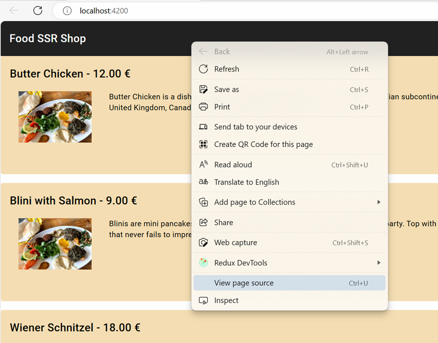

# Server Side Rendering (SSR)

- Create a new Angular project. Starting with Angular 17 SSR is enabled by default. To disable it use `--ssr=false`. So you could basically skip the `--ssr=true` option. To add it to an existing project use `ng add @angular/ssr`:

  ```
  ng new food-shop-ssr --routing --style=scss --ssr=true
  cd food-shop-ssr
  ```

- Examine `package.json` and note the `@angular/ssr`and `express` dependencies. Also note the `serve:ssr:food-shop-ssr` script. It starts the Node Express server and runs the Angular app in SSR mode.

- Examine the registration of [ClientHydration](https://angular.io/guide/hydration) in `app.config.ts`:

  ```typescript
  export const appConfig: ApplicationConfig = {
  providers: [
      provideZoneChangeDetection({ eventCoalescing: true }),
      provideRouter(routes),
      provideClientHydration(withEventReplay())
  ]
  };
  ```

- Add Component Input Binding to `app.config.ts` for the `FoodDetailsComponent` that we will use later

    ```typescript
    provideRouter(routes, withComponentInputBinding()),
    ```

- Add the HttpClient with fetch mode enabled which is beneficial for SSR:

  ```typescript
  provideHttpClient(
    withFetch()
  ),
  ```  

- Add the environment configuration using Angular CLI:

  ```
  ng g environment
  ```

- Add the following configuration:

  ```typescript
  export const environment = {
      api: 'http://localhost:3000/',
  };
  ```

- Add Angular Material and chose any predefined theme. For example, `Azure/Blue`. Add Typography styles and animations:

  ```
  ng add @angular/material
  ```

- Add the following packages for NgRx SignalStore:

    ```bash
    nmp i @ngrx/signal-store @ngrx/signals
    ```

- To save some time you will provided with the [artifacts](./food-shop-ssr-artifacts/) of this app:


  > Note: After adding each file review the code and make sure you understand it.

- Add the following html to app.component.html and also add the required imports for MatToolbarModule:

  ```html
  <mat-toolbar>
      <mat-toolbar-row>
          Food SSR Shop
      </mat-toolbar-row>
  </mat-toolbar>
  <router-outlet></router-outlet>
  ```

- Add the items from `food-shop-artifacts` to the app folder and update app.routes.ts:

  ```typescript
    export const routes: Routes = [
        {
            path: '',
            component: FoodListComponent,
        },
        {
            path: ':id',
            component: FoodDetailsComponent,
        }
    ];
  ```

- Add a script to track First Contentful Paint (FCP) to the `<head>` of `index.html`:

  ```javascript
  <script>
      // Log first contentful paint
      // https://web.dev/fcp/#measure-fcp-in-javascript
      const observer = new PerformanceObserver((list) => {
      for (const entry of list.getEntriesByName("first-contentful-paint")) {
          console.log("FCP: ", entry.startTime);
          observer.disconnect();
      }
      });
      observer.observe({ type: "paint", buffered: true });
  </script>
  ```

  > Note: Reade more about [PerformanceObserver](https://developer.mozilla.org/en-US/docs/Web/API/PerformanceObserver) on MDN and on [web.dev](https://web.dev/articles/user-centric-performance-metrics).

- Execute Client and note the `First Contentful Paint (FCP)` value in the console:

  ```bash
  ng s -o
  ```

- Examine the page source and note that the content is rendered by the browser using javascript:

  

- Execute Node Express on `http://localhost:4000` and compare `First Contentful Paint (FCP)` values and examine the html source. Also create Lighthouse Audit and compare time used for `Scripting`

  ```bash
  ng build
  npm run serve:ssr:food-shop-ssr
  ```

  > Note: If you get a warning that the maximum bundle size is exceeded, you can increase it by setting ` "maximumWarning": "550kb",` in `angular.json`.

## Use Pre-rendering

- Run this simple mock shopping site to get familiar to it

- Add routes to `app.routes.ts`:

  ```typescript
  export const foodRoutes: Routes = [
      {
          path: '',
          component: FoodListComponent,
      },
      {
          path: 'food/:id',
          component: FoodDetailsComponent,
      }
  ];
  ```

- Create `routes.txt` in the root folder. It defines routes to pre-render:

```
/food/1
/food/2
/food/3
```

- To configure pre-rendered pages open `angular.json` and replace the following to the `architect` section:

  ```json
  "prerender": true,
  ```

  with:

  ```json
  "prerender": {
      "routesFile": "routes.txt"
  },
  ```

- Execute pre-rendering:

  ```bash
  ng build -c production
  ```

- Examine `dist\food-list-ssr\browser\food\...`
