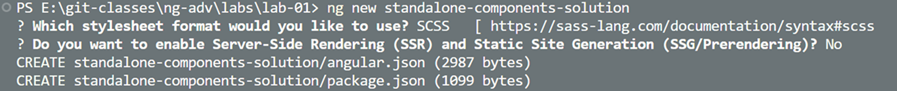

# Food App - Standalone Components

## Introduction

In this lab, we will create a new Angular standalone project. We will create a navbar component and a sidebar component using Angular Material for the navbar. Additionally, we will use json-server to create a fake backend. By the end of this lab, you will have a better understanding of how to set up and configure an Angular standalone project with Angular Material and json-server.

## Prerequisites

Before starting this lab, make sure you have the following installed:

- Node.js and npm
- Angular CLI
- json-server

## Step-by-Step Guide

### Step 1: Install json-server

Install json-server globally using npm:

```bash
npm i -g json-server
```

### Step 2: Create a New Angular Project

Create a new Angular project using SCSS and without server-side rendering:



> Note: You can skip answering the questions by using the following command:

```bash
ng new standalone-component-solution --routing --style=scss --ssr=false
```

### Step 3: Add Angular Material

Add Angular Material to the project and choose a theme:

```bash
ng add @angular/material
```


### Step 4: Add Environment Configuration

Generate environment configuration files:

```bash
ng g environments
```

Modify the `environment.ts` and `environment.development.ts` files to reflect the base URL of `json-server`:

```typescript
export const environment = {
    api: 'http://localhost:3000',
};
```

### Step 5: Create a Fake Backend

Create a `db.json` file in the root folder with the following content:

```json
{
    "top-links": [
        {
            "title": "Home",
            "url": ""
        },
        {
            "title": "About",
            "url": "/about"
        },
        {
            "title": "Food",
            "url": "/food"
        }
    ]
}
```

Run json-server to serve the fake backend:

```bash
json-server --watch db.json
```

### Step 6: Configure Standalone Components

Go to `src/main.ts` and `src/app` and notice the standalone configuration, especially `app.config.ts` and `app.routes.ts`. Examine these files. Also, notice that `app.module.ts` is not present. Add the provider function for `HttpClient` in `app.config.ts`:

```typescript
export const appConfig: ApplicationConfig = {
    providers: [
        ...
        provideHttpClient(),
    ]
};
```

### Step 7: Create Navbar and Sidebar Components

Create a navbar component in the shared folder. Notice that with a project created with Angular 17+, all components are created as standalone components by default:

```bash
ng g c shared/navbar
```

Repeat this step to create a sidebar component in the shared folder:

```bash
ng g c shared/sidebar
```

### Step 8: Create Additional Components

Create a food component in the food folder:

```bash
ng g c food/food
```

Repeat this step to create a home component and an about component in the root folder.

### Step 9: Import Components and Configure App Component

Import the NavBar and Sidebar components to the `app.component.ts` file. Also, add the imports for `RouterOutlet`:

```typescript
@Component({
    selector: 'app-root',
    standalone: true,
    imports: [RouterOutlet, NavbarComponent, SidebarComponent],
    templateUrl: './app.component.html',
    styleUrl: './app.component.scss'
})
export class AppComponent {}
```

Replace the HTML in `app.component.html` with the following:

```html
<div>
    <app-navbar></app-navbar>
</div>
<div class="mainRow">
    <div class="sideBar">
        <app-sidebar></app-sidebar>
    </div>
    <div class="main">
        <router-outlet></router-outlet>
    </div>
</div>
```

Add the following styles to the `app.component.scss` file:

```scss
.sideBar {
    background-color: lightgrey;
    width: 180px;
}

.main {
    min-width: 80vw;
    flex-grow: 1;
    margin: 0 2rem;
}

.mainRow {
    display: flex;
    flex-direction: row;
    width: 100%;
    height: 90vh;
}
```

### Step 10: Configure Sidebar Component

Add `MatToolbarModule` and `MatListModule` to `sidebar.component.ts`:

```typescript
@Component({
    selector: 'app-sidebar',
    standalone: true,
    imports: [MatToolbarModule, MatListModule],
    templateUrl: './sidebar.component.html',
    styleUrl: './sidebar.component.scss'
})
export class SidebarComponent {}
```

Add the MatToolbar and MatList to the `sidebar.component.html`:

```html
<mat-toolbar> Mock Submenu </mat-toolbar>

<mat-list role="list" color="accent">
    <mat-list-item role="listitem">Item 1</mat-list-item>
    <mat-list-item role="listitem">Item 2</mat-list-item>
    <mat-list-item role="listitem">Item 3</mat-list-item>
</mat-list>
```

### Step 11: Run the Application

Run the application to check the result:

```bash
ng s -o
```

At this point, you should have a navbar and a sidebar in the app component but no content in the main section. Also, they do not look very nice.

### Step 12: Create Navbar Service and Model

In the `shared/navbar` folder, create a `nav-item.model.ts`:

```typescript
export class NavItem {
    title = '';
    url = '';
}
```

In the `shared/navbar` folder, create a `navbar.service.ts`:

```typescript
@Injectable({
    providedIn: 'root'
})
export class NavbarService {
    http = inject(HttpClient);

    getTopItems() {
        return this.http.get<NavItem[]>(`${environment.api}/top-links`);
    }
}
```

### Step 13: Inject Navbar Service

Inject the `NavbarService` in the `navbar.component.ts`:

```typescript
@Component({
    selector: 'app-navbar',
    standalone: true,
    imports: [AsyncPipe, RouterLink, MatToolbarModule],
    templateUrl: './navbar.component.html',
    styleUrl: './navbar.component.scss'
})
export class NavbarComponent {
    ns = inject(NavbarService);
    items = this.ns.getTopItems();
}
```

Modify the `navbar.component.html`:

```html
<mat-toolbar color="primary">
    <mat-toolbar-row>
        <div *ngFor="let item of items | async" [routerLink]="[item.url]">
            {{ item.title }}
        </div>
    </mat-toolbar-row>
</mat-toolbar>
```

Add the following styles to the `navbar.component.scss`:

```scss
mat-toolbar {
    margin-bottom: 0.8rem;
}

mat-toolbar-row {
    div {
        margin: 0.5rem;
        cursor: pointer;
    }
}
```

### Step 14: Update Route Configuration

Update the route configuration in `app.routes.ts`:

```typescript
export const routes: Routes = [
    { path: "", component: HomeComponent },
    { path: "food", component: FoodComponent },
    { path: "about", component: AboutComponent }
];
```

### Step 15: Review Main Configuration

Review that `appConfig` is used in `main.ts`:

```typescript
bootstrapApplication(AppComponent, appConfig)
    .catch((err) => console.error(err));
```

## Summary

In this lab, we created a new Angular standalone project with a navbar and a sidebar using Angular Material. We also set up a fake backend using json-server. By following the step-by-step guide, you should now have a better understanding of how to configure and set up an Angular standalone project with Angular Material and json-server.
