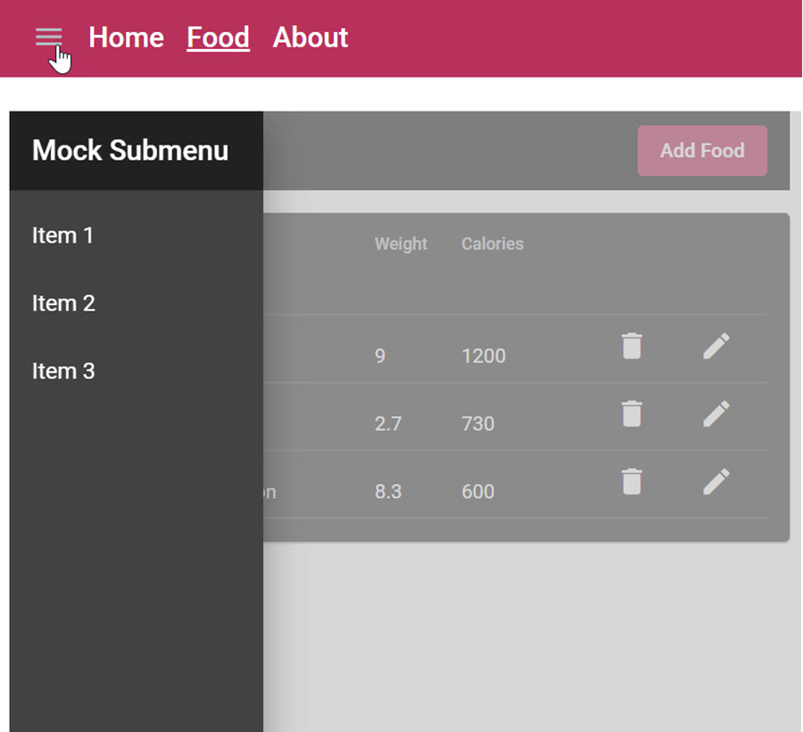

# Food App - State

In this lab we will implement a responsive Side Menu using [Angular Material SideNav](https://material.angular.io/components/sidenav/overview) and a Stateful Service using BehaviorSubjects. To handle reactivity of the screen width we will use the [BreakpointObserver](https://material.angular.io/cdk/layout/overview) from Angular Material.

## Implement a responsive Side Menu:

- You can take the [demo.container](../../demos/03-state-ngrx/ngrx-state/src/app/demos/demo-container/demo-container.component.ts) and the [sidenav.service.ts](../../demos/03-state-ngrx/ngrx-state/src/app/shared/sidenav/sidenav.service.ts) as a reference.

  

- Implement a sidenav.service.ts as a Stateful Service using BehaviorSubjects with the two properties:

    - sideNavVisible: boolean
    - sideNavPosition: over | side

    ```typescript
    sideNavVisible: BehaviorSubject<boolean> = new BehaviorSubject<boolean>(true);
    sideNavPosition: BehaviorSubject<MatDrawerMode> = new BehaviorSubject<MatDrawerMode>('side');
    ```
- Inject BreakpointObserver in the sidenav.service.ts and use it to toggle the sideNavPosition property.

  ```typescript
  constructor() {
    this.watchScreen.subscribe();
  }

  watchScreen = this.breakpointObserver
    .observe([Breakpoints.XSmall, Breakpoints.Small])
    .pipe(
      tap((matchesBreakpoint) => {
        console.log(matchesBreakpoint);
        this.sideNavVisible.next(matchesBreakpoint.matches ? false : true);
        this.sideNavPosition.next(matchesBreakpoint.matches ? 'over' : 'side');
      })
    );

  toggleMenuVisibility() {
    const visible = !this.sideNavVisible.getValue();
    this.sideNavVisible.next(visible);
  }
  ```
- Add a Material SideNav to app.component.html    

  ```html
  <div class="grid">
    <div class="gd-navbar">
      <app-navbar></app-navbar></div>
    <div class="gd-loading">
      <!-- <app-loading *ngIf="isLoading | async"></app-loading> -->
    </div>
    <div class="gd-mainrow">
      <mat-sidenav-container>
        <mat-sidenav #sidenav class="sidenav"
        [opened]="ms.sideNavVisible | async"
        [mode]="mode">
          <app-sidebar></app-sidebar>
        </mat-sidenav>
        <mat-sidenav-content [ngStyle]="getWorkbenchStyle()">
          <router-outlet></router-outlet>
        </mat-sidenav-content>
      </mat-sidenav-container>
    </div>
  </div>
  ``` 
- Add a required css to app.component.scss

  ```css
  .grid {
    display: grid;
    height: 100vh;
    width: 100%;
    gap: 0.5rem;
    grid-template-rows: 70px 10px calc(100vh - 100px);
    grid-template-columns: auto;
    grid-template-areas:
      "navbar"
      "loading"
      "mainrow";
  }

  .gd-navbar {
    grid-area: navbar;
  }

  .gd-loading {
    grid-area: loading;
  }

  .gd-mainrow {
    grid-area: mainrow;
    background-color: lightgray;
  }

  .sidenav{
    height: 80vh;
  }

  .mat-drawer-container {
    height: 100%;
  } 
  ```