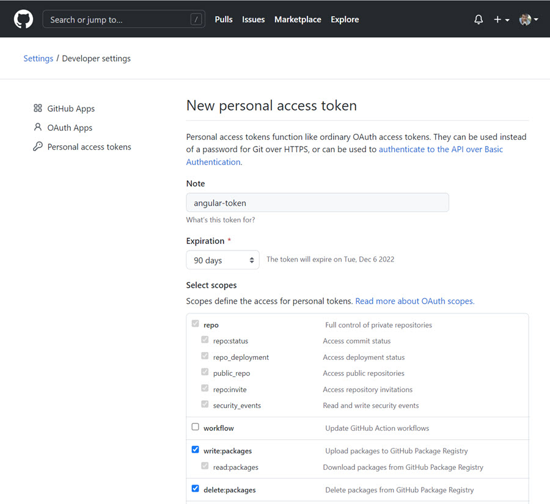

# Angular Libraries

Create a host project & Add Material & Flex Layout:

```
ng new ux-lib --routing --style scss
cd ux-lib
ng add @angular/material
```

>Note: Use this settings when adding material:


Create Library:

```
ng g library ux-controls --prefix=ux
```

In `projects\ux-controls\lib\` delete the service `ux-controls.service.ts`, `ux-controls.component.ts` and its \*.spec-files. Remove it from `ux-controls.module.ts` and `public-api.ts`

### Implement a the Split Control

Implement a split component that divides the screen in a T-layout:

```
ng g c controls/split --project=ux-controls
```

>Note: The default stylesheet is *.css. You can change this behaviour by executing: 

```bash
ng config projects.ux-controls.schematics.@schematics/angular:component.style scss
```

Update `ux-controls.module.ts`:

```typescript
import { NgModule } from '@angular/core';
import { MatToolbarModule } from '@angular/material/toolbar';
import { SplitComponent } from './controls/split/split.component';

@NgModule({
  declarations: [SplitComponent],
  imports: [MatToolbarModule],
  exports: [SplitComponent],
})
export class UxControlsModule { }
```

>Note: The "ng g c ..." cli call does not register the component in the module. This must be done manually as seen above.

Update PeerDependencies in `package.json` of the library:

```typescript
"peerDependencies": {
    "@angular/common": "^15.2.0",
    "@angular/core": "^15.2.0",
    "@angular/animations": "^15.2.0",
    "@angular/material": "^15.2.0"
  },
```

> Note: You might want to change version numbers depending on the current versions

split.component.ts:

```typescript
import { Component, OnInit } from '@angular/core';

@Component({
  selector: 'ux-split',
  templateUrl: './split.component.html',
  styleUrls: ['./split.component.scss'],
})
export class SplitComponent  {
  toolbar = '100px';
  constructor() {}
}
```

split.component.html

```html
<div class="maingrid">
  <div class="title">
    <mat-toolbar>
      <mat-toolbar-row color="primary">
        <ng-content select=".title"></ng-content>
      </mat-toolbar-row>
    </mat-toolbar>
  </div>
  <div class="main">
    <ng-content select=".main"></ng-content>
  </div>
  <div class="sidebar">
    <ng-content select=".sidebar"></ng-content>
  </div>
</div>
```

split.component.scss:

```css
.maingrid {
  display: grid;
  grid-template-rows: 60px auto;
  grid-template-columns: auto 180px;
  grid-template-areas: "title title" "main sidebar";
  height: 100vh;
  width: 100%;
}

.title{
  grid-area: title;
  background-color: lavender;
}

.main{
  padding: 1rem;
  grid-area: main;
  background-color: yellow;
}

.sidebar{
  padding: 1rem;
  grid-area: sidebar;
  background-color: lightblue;
}
```

Modify `public-api.ts`:

```typescript
export * from './lib/controls/split/split.component';
export * from './lib/ux-controls.module';
```

Build Library:

```
ng build --project ux-controls
```

> Note: You could also run `ng build ux-controls` or use the `--watch` flag

### Use the Split Control

To use the Component import it in `app.module.ts` of you Main Project

```typescript
import { UxControlsModule} from "ux-controls"

@NgModule({
  ...
  imports: [
    ...
    UxControlsModule
  ],
  ...
})
export class AppModule { }
```

Add it to `app.component.ts` and run `ng s -o`:

```html
<ux-split>
  <div class="title">UX Split</div>
  <div class="main">Main Content</div>
  <div class="sidebar">Sidebar Buttons</div>
</ux-split>
```

Test the component:

```
ng serve -o --project ux-lib
```
---
## Publish Library to GitHub Packages

In your GitHub Account go to `Settings/Developer settings`, create an new token with `write:packages` and `delete:packages` and copy it afterwards:




Add an .npmrc to the folder of the lib:

```
@<GITHubUSERNAME>:registry=https://npm.pkg.github.com/
//npm.pkg.github.com/:_authToken=<TOKEN>
```

Build the project:

```
ng build -c production --project ux-controls 
```

Login to GitHub Packages:

```bash
npm login --registry=https://npm.pkg.github.com
npm adduser
```

Publish the lib from the folder of the lib:

```
npm publish
```

Check the result:


Go to the `Package settings` in the `Package Details` and change visibility to publish


### Use Library in another project

Create a new project:

```
ng new ux-lib-consumer --routing --style scss
```

Add an .npmrc:

```
//npm.pkg.github.com/:_authToken=<TOKEN>
@<GITHubUSERNAME>:registry=https://npm.pkg.github.com/
```

Install the package:

```
npm install -S @arambazamba/ux-controls@15.0.0
```